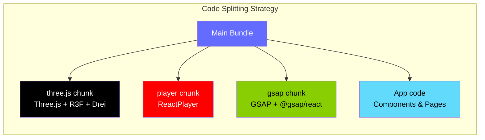
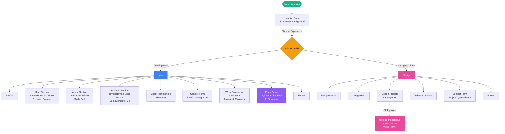
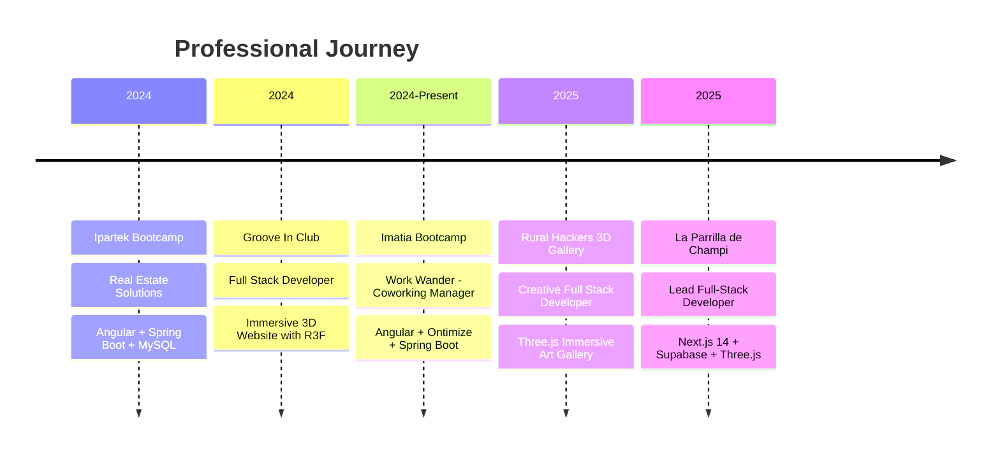
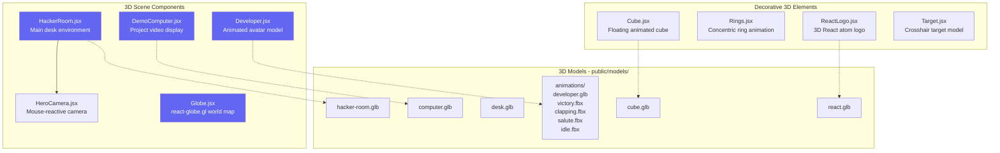

<div align="center">

# Alejandro Gonzalez Lopez

### Interactive 3D Portfolio

<br/>

[](https://www.aleglopez.tech)
[](https://github.com/aleglope/threejs-portfolio)
[](LICENSE)

<br/>


<br/><br/>

> A cutting-edge interactive portfolio combining modern web development with immersive 3D experiences. Two portfolios in one: **Development** & **Design/Video**.

<br/>

[Features](#-features) · [Architecture](#-architecture) · [Tech Stack](#-tech-stack) · [Getting Started](#-getting-started) · [Projects](#-featured-projects) · [Contact](#-contact)

</div>

---

## Overview

This portfolio is a multi-page React application that showcases my work as a **Full Stack Developer** and **Creative Designer**. It features an interactive 3D landing page where visitors choose between two experiences: a development portfolio with live demos, 3D environments, and an embedded Pong game; or a design portfolio featuring graphic design, VJing, AI-generated content, and videography.

---

## Features

<table>
<tr>
<td width="50%">

### Development Portfolio
- Interactive 3D hero with HackerRoom model
- Live project demos with video previews
- Animated 3D developer avatar with multiple animations
- Interactive 3D globe showing location
- Embedded Pong game (Python via Pyodide)
- Client testimonials carousel
- Work experience timeline
- Contact form with EmailJS integration

</td>
<td width="50%">

### Design & Video Portfolio
- Brand identity & UX/UI showcase
- AI-generated advertising content
- Music event visuals & VJing gallery
- Photography & videography enhanced by AI
- Video showcase with ReactPlayer
- Project detail pages with image galleries
- Creative contact form

</td>
</tr>
</table>

### Shared Features

| Feature | Description |
|---|---|
| **Custom Cursor Trail** | Dynamic particle trail effect following mouse movement |
| **Responsive Design** | Adaptive layouts for mobile, tablet & desktop with `react-responsive` |
| **GSAP Animations** | Professional-grade transitions, scroll-triggered animations & hover effects |
| **3D Elements** | Floating cubes, React logos, rings & target models on landing page |
| **Vercel Analytics** | Performance monitoring with Speed Insights & Analytics |
| **SPA Routing** | Client-side routing with React Router DOM |

---

## Architecture

```mermaid
graph TB
    subgraph "Entry Point"
        A[App.jsx<br/>React Router] --> B["/  LandingPage"]
        A --> C["/dev  DevPortfolio"]
        A --> D["/design  DesignPortfolio"]
        A --> E["/design/project/:slug<br/>ProjectDetail"]
    end

    subgraph "Landing Page"
        B --> B1[3D Canvas<br/>Cubes, Rings, ReactLogo, Target]
        B --> B2[Portfolio Selection Cards]
        B --> B3[CursorTrail]
    end

    subgraph "Dev Portfolio Sections"
        C --> C1[Navbar]
        C --> C2[Hero - HackerRoom 3D]
        C --> C3[About - Globe 3D]
        C --> C4[Projects - Video Demos]
        C --> C5[Clients - Testimonials]
        C --> C6[Contact - EmailJS]
        C --> C7[Experience - Timeline]
        C --> C8[Pong - Pyodide Game]
        C --> C9[Footer]
    end

    subgraph "Design Portfolio Sections"
        D --> D1[DesignNavbar]
        D --> D2[DesignHero]
        D --> D3[DesignProjects]
        D --> D4[VideoShowcase]
        D --> D5[Contact]
        D --> D6[Footer]
    end

    style A fill:#6366f1,color:#fff
    style B fill:#3b82f6,color:#fff
    style C fill:#3b82f6,color:#fff
    style D fill:#ec4899,color:#fff
    style E fill:#ec4899,color:#fff
```



### Project Structure

```
threejs-portfolio/
├── public/
│   ├── assets/              # Images, SVGs, icons, brand logos
│   │   ├── poster/          # 27 event poster images
│   │   └── brands/          # Brand collaboration logos
│   ├── models/              # 3D models (.glb, .fbx)
│   │   ├── hacker-room.glb  # Main hero 3D scene
│   │   ├── computer.glb     # Demo computer model
│   │   ├── desk.glb         # Desk model
│   │   ├── react.glb        # React logo 3D
│   │   ├── cube.glb         # Animated cube
│   │   └── animations/      # Developer avatar animations
│   │       ├── developer.glb
│   │       ├── victory.fbx
│   │       ├── clapping.fbx
│   │       ├── salute.fbx
│   │       └── idle.fbx
│   ├── pong_game/           # Python Pong game modules
│   │   ├── main.py          # Game entry point
│   │   ├── canvas2d.py      # Canvas rendering bridge
│   │   ├── ball.py          # Ball physics
│   │   ├── paddle.py        # Paddle controls
│   │   ├── collision.py     # Collision detection
│   │   ├── score.py         # Score tracking
│   │   ├── AI.py            # Adaptive AI opponent
│   │   └── screen.py        # Screen management
│   └── textures/            # Textures & video previews
│       ├── project/         # 8 project demo videos (.mp4)
│       ├── desk/            # Desk component textures
│       └── globe/           # Globe cloud texture
├── src/
│   ├── components/          # Reusable 3D & UI components
│   │   ├── HackerRoom.jsx   # Main 3D room scene
│   │   ├── HeroCamera.jsx   # Dynamic camera controller
│   │   ├── Globe.jsx        # Interactive 3D globe
│   │   ├── Developer.jsx    # Animated 3D developer avatar
│   │   ├── DemoComputer.jsx # Project demo display
│   │   ├── Cube.jsx         # Animated floating cube
│   │   ├── Rings.jsx        # Decorative 3D rings
│   │   ├── ReactLogo.jsx    # 3D React logo
│   │   ├── Target.jsx       # 3D target model
│   │   ├── CursorTrail.jsx  # Custom cursor effect
│   │   ├── Button.jsx       # Reusable button component
│   │   ├── CanvasLoader.jsx # 3D loading spinner
│   │   ├── Alert.jsx        # Notification alerts
│   │   └── SketchfabModel.jsx # Sketchfab embed
│   ├── sections/            # Page sections
│   │   ├── Hero.jsx         # 3D hero section
│   │   ├── About.jsx        # About grid with globe
│   │   ├── Projects.jsx     # Project showcase
│   │   ├── Experience.jsx   # Work experience timeline
│   │   ├── Clients.jsx      # Client testimonials
│   │   ├── Contact.jsx      # Contact form (EmailJS)
│   │   ├── Pong.jsx         # Embedded Pong game
│   │   ├── Navbar.jsx       # Dev portfolio nav
│   │   ├── Footer.jsx       # Footer with socials
│   │   └── design/          # Design portfolio sections
│   │       ├── DesignHero.jsx
│   │       ├── DesignNavbar.jsx
│   │       ├── DesignProjects.jsx
│   │       └── VideoShowcase.jsx
│   ├── pages/               # Route pages
│   │   ├── LandingPage.jsx  # Portfolio selector
│   │   ├── DevPortfolio.jsx # Development portfolio
│   │   ├── DesignPortfolio.jsx # Design portfolio
│   │   └── ProjectDetail.jsx   # Design project detail
│   ├── hooks/
│   │   └── useAlert.js      # Alert state management
│   ├── constants/
│   │   ├── index.js         # Dev portfolio data
│   │   └── design.js        # Design portfolio data
│   ├── App.jsx              # Root component with routing
│   ├── main.jsx             # Entry point
│   └── index.css            # Global styles & Tailwind
├── index.html               # HTML template
├── vite.config.js           # Vite config with code splitting
├── tailwind.config.js       # Custom theme (colors, fonts)
├── postcss.config.js        # PostCSS + Autoprefixer
├── eslint.config.js         # ESLint + React Three rules
├── vercel.json              # SPA rewrite rules
└── package.json
```

---

## Tech Stack

### Core Framework

| Technology | Version | Purpose |
|---|---|---|
|  | `18.3.1` | UI component library |
|  | `6.0.3` | Build tool & dev server |
|  | `7.9.5` | Client-side routing |

### 3D Graphics

| Technology | Version | Purpose |
|---|---|---|
|  | `0.171.0` | 3D rendering engine |
|  | `8.17.10` | React renderer for Three.js |
|  | `9.120.4` | R3F utility components |
|  | `2.28.3` | Interactive 3D globe |

### Styling & Animation

| Technology | Version | Purpose |
|---|---|---|
|  | `3.4.17` | Utility-first CSS |
|  | `3.12.5` | Professional animations |
|  | `8.4.49` | CSS processing |

### Integrations

| Technology | Version | Purpose |
|---|---|---|
|  | `4.4.1` | Contact form email service |
|  | `1.4.1` | Performance analytics |
|  | CDN | Python runtime in browser |
|  | `2.16.0` | Video playback |
|  | `0.9.35` | 3D debug controls |
|  | `5.5.0` | Icon library |

### Dev Tools

| Technology | Version | Purpose |
|---|---|---|
|  | `9.17.0` | Code linting |
|  | `10.4.20` | CSS vendor prefixes |

---

## Build Optimization

The project uses **Vite** with custom Rollup chunking for optimal load performance:



---

## Getting Started

### Prerequisites

- **Node.js** v16 or higher
- **npm** or **yarn**

### Installation

```bash
# Clone the repository
git clone https://github.com/aleglope/threejs-portfolio.git

# Navigate to the project directory
cd threejs-portfolio

# Install dependencies
npm install

# Start development server
npm run dev
```

### Environment Variables

Create a `.env` file in the project root:

```env
VITE_EMAILJS_SERVICE_ID=your_service_id
VITE_EMAILJS_TEMPLATE_ID=your_template_id
VITE_EMAILJS_PUBLIC_KEY=your_public_key
```

### Available Scripts

| Command | Description |
|---|---|
| `npm run dev` | Start development server on `127.0.0.1:5173` |
| `npm run build` | Build for production |
| `npm run preview` | Preview production build |
| `npm run lint` | Run ESLint |

---

## Application Flow



---

## Featured Projects

### Development Projects

<table>
<tr>
<td align="center" width="25%">

**Turtle Race Game**

[](https://github.com/aleglope/Turtle-Race)

`Python` `Turtle Graphics`

</td>
<td align="center" width="25%">

**Billboard to Spotify**

[](https://github.com/aleglope/Song-Search-Engine)

`Python` `Spotify API` `Scraping`

</td>
<td align="center" width="25%">

**Galicia Map Quiz**

[](https://github.com/aleglope/Game-of-Regions)

`Python` `Tkinter`

</td>
<td align="center" width="25%">

**Coworking Manager**

[](https://github.com/CampusDual/cd2024bfs5g1)

`Angular` `Spring Boot` `PostgreSQL`

</td>
</tr>
<tr>
<td align="center" width="25%">

**Groove In Club**

[](https://www.grooveinclub.es/)

`React` `Three.js` `TypeScript`

</td>
<td align="center" width="25%">

**GeoJSON Mapping**

[](https://github.com/aleglope/Land-Parcel-Mapping)

`Python` `Folium` `GIS`

</td>
<td align="center" width="25%">

**Real Estate App**

[](https://github.com/aleglope/Real-Estate-Backend)

`Angular` `Spring Boot` `MySQL`

</td>
<td align="center" width="25%">

**Restaurant Frontend**

[](https://restaurant-phi-six.vercel.app/)

`React`

</td>
</tr>
</table>

### Design & Creative Projects

| Project | Category | Highlights |
|---|---|---|
| **Brand Identity & UX/UI Design** | Graphic Design | AI-enhanced logos, UX/UI systems, brand guidelines |
| **AI-Generated Advertising** | AI Content | AI video generation, avatars, automated content |
| **Music Event Visuals & VJing** | Music & Events | Psychedelic posters, concert visuals, live VJ sets |
| **AI-Enhanced Photography** | Photography | AI-enhanced videography and photographic art |

---

## Work Experience



---

## 3D Components



---

## Pong Game

The portfolio includes a fully playable **Pong** game implemented in Python, running in the browser via **Pyodide**:

| Module | Role |
|---|---|
| `main.py` | Game entry point & loop (`requestAnimationFrame`) |
| `canvas2d.py` | JavaScript Canvas API bridge |
| `ball.py` | Ball physics & movement |
| `paddle.py` | Player paddle controls |
| `collision.py` | Collision detection system |
| `score.py` | Score tracking & display |
| `AI.py` | Adaptive difficulty AI opponent |
| `screen.py` | Screen & viewport management |

---

## Deployment

The project is deployed on **Vercel** with:

- **Automatic CI/CD** from GitHub pushes
- **Preview deployments** for every pull request
- **SPA rewrites** via `vercel.json` for client-side routing
- **Vercel Analytics** & **Speed Insights** for monitoring
- **Edge-optimized** global content delivery

---

## Responsive Design

| Breakpoint | Target | 3D Adaptation |
|---|---|---|
| `< 440px` | Small mobile | Reduced model scale, adjusted positions |
| `< 768px` | Mobile | Compact layout, touch-optimized interactions |
| `768px - 1024px` | Tablet | Medium 3D elements, balanced positioning |
| `> 1024px` | Desktop | Full 3D experience with all effects |

---

## Contact

<div align="center">

[](mailto:agonzlopez.11@gmail.com)
[](https://github.com/aleglope)
[](https://www.aleglopez.tech)
[](https://www.tiktok.com/@nextworldai)

<br/>

**Open to collaborations in:**

`Web Applications` · `3D Immersive Experiences` · `Full-Stack Systems` · `AI Integration` · `Remote Work`

<br/>

---

<sub>Built with passion by **Alejandro Gonzalez Lopez** | Full Stack Developer & Creative Designer</sub>

</div>
